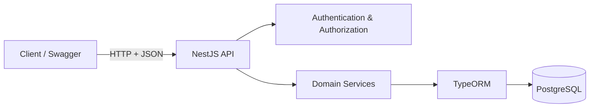
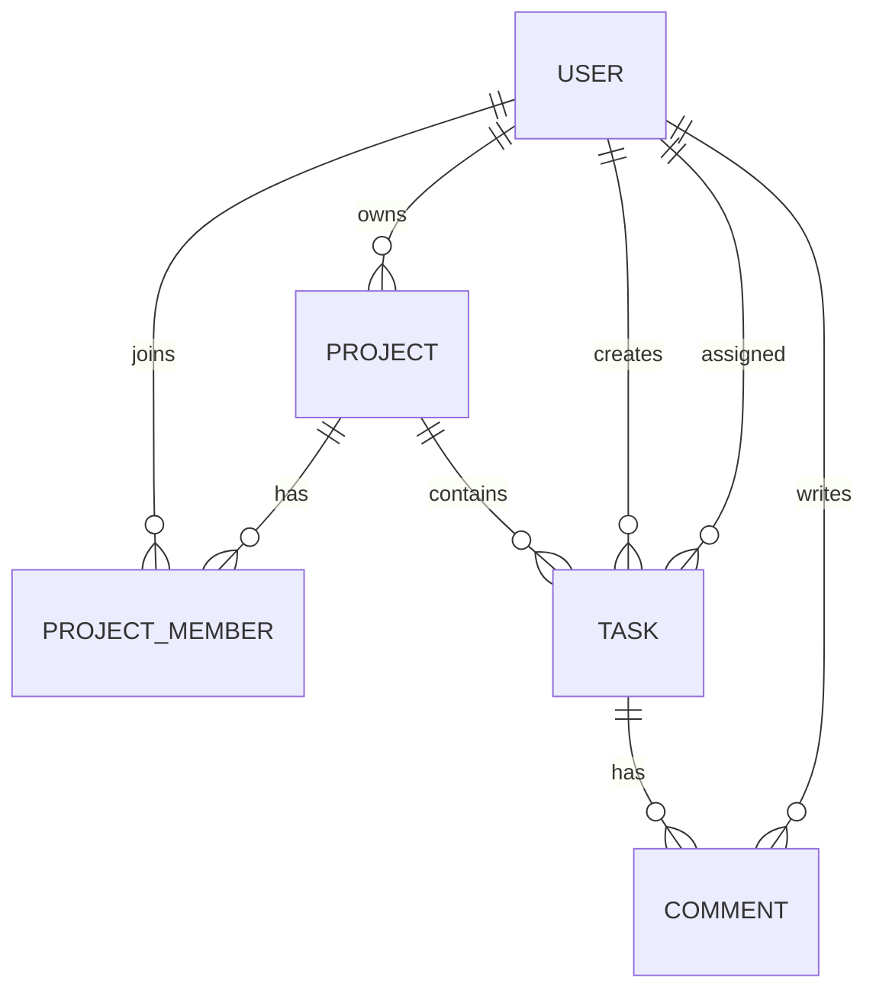

# TaskFlow API

A REST API for project and task management built with NestJS, TypeScript and PostgreSQL.

## Overview

TaskFlow API is a lightweight backend for managing projects, project members, tasks, and task comments. It is designed as a clean portfolio project that demonstrates common backend fundamentals without unnecessary infrastructure.

## Features

- User registration, login, and current-user endpoints
- JWT authentication and role-based admin endpoints
- Project CRUD with owner/member authorization
- Project member management by project owners
- Task CRUD with assignee membership validation
- Task search, filtering, sorting, and pagination
- Task comments with own-comment or admin mutation rules
- Project task statistics
- Swagger documentation in development
- PostgreSQL migrations, seed data, Docker, linting, and tests

## Technology Stack

Node.js, TypeScript, NestJS, PostgreSQL, TypeORM, JWT, bcrypt, class-validator, class-transformer, Swagger/OpenAPI, Jest, Docker, Docker Compose, ESLint, and Prettier.

## Architecture



## Database Model



All primary keys are UUIDs. Passwords are stored as bcrypt hashes and never returned by API responses.

## Authentication & Authorization

Authentication uses JWT bearer tokens. Authorization is enforced separately through guards and service-level ownership/membership checks.

Project access requires ownership or membership. Project member changes require ownership. Task assignees must already belong to the project. Comment updates and deletes are limited to the author unless the current user is an admin.

## API Endpoints

- `POST /api/v1/auth/register`
- `POST /api/v1/auth/login`
- `GET /api/v1/auth/me`
- `GET /api/v1/users/me`
- `PATCH /api/v1/users/me`
- `GET /api/v1/users` admin only
- `GET /api/v1/users/:id` admin only
- `POST /api/v1/projects`
- `GET /api/v1/projects`
- `GET /api/v1/projects/:id`
- `PATCH /api/v1/projects/:id`
- `DELETE /api/v1/projects/:id`
- `GET /api/v1/projects/:id/members`
- `POST /api/v1/projects/:id/members`
- `DELETE /api/v1/projects/:id/members/:userId`
- `POST /api/v1/projects/:projectId/tasks`
- `GET /api/v1/projects/:projectId/tasks`
- `GET /api/v1/tasks/:id`
- `PATCH /api/v1/tasks/:id`
- `DELETE /api/v1/tasks/:id`
- `POST /api/v1/tasks/:taskId/comments`
- `GET /api/v1/tasks/:taskId/comments`
- `PATCH /api/v1/comments/:id`
- `DELETE /api/v1/comments/:id`
- `GET /api/v1/projects/:id/stats`
- `GET /api/v1/health`

## Getting Started

```bash
npm install
cp .env.example .env
npm run migration:run
npm run seed
npm run start:dev
```

The API runs at `http://localhost:3000/api/v1`.

## Environment Variables

Copy `.env.example` to `.env` and replace the placeholder values. Use a long random `JWT_SECRET` outside local development.

## Running with Docker

```bash
docker compose up --build
```

The API service connects to PostgreSQL through the Compose service name `postgres`. The PostgreSQL data directory is persisted in the named `postgres_data` volume.

## Database Migrations

```bash
npm run migration:generate -- src/database/migrations/NameOfMigration
npm run migration:run
npm run migration:revert
```

Production startup does not use `synchronize`; the Docker image runs compiled migrations before starting the API.

## Seed Data

```bash
npm run seed
```

Seed accounts use fake data only:

- `admin@example.com / Example123!`
- `alex@example.com / Example123!`
- `jordan@example.com / Example123!`
- `taylor@example.com / Example123!`

## Testing

```bash
npm run lint
npm run test
npm run test:e2e
npm run build
```

The E2E suite uses an in-memory PostgreSQL-compatible adapter through TypeORM so it can run without a local database process.

## Swagger Documentation

In non-production environments, Swagger is available at:

```text
http://localhost:3000/api/docs
```

Bearer authentication is configured in Swagger for protected endpoints.

## Example Requests

Register:

```bash
curl -X POST http://localhost:3000/api/v1/auth/register \
  -H "Content-Type: application/json" \
  -d '{"name":"Jamie Reed","email":"jamie@example.com","password":"StrongPassword123!"}'
```

Login:

```bash
curl -X POST http://localhost:3000/api/v1/auth/login \
  -H "Content-Type: application/json" \
  -d '{"email":"alex@example.com","password":"StrongPassword123!"}'
```

Create a project:

```bash
curl -X POST http://localhost:3000/api/v1/projects \
  -H "Authorization: Bearer <token>" \
  -H "Content-Type: application/json" \
  -d '{"name":"Website Redesign","description":"Refresh the public website."}'
```

Filter tasks:

```bash
curl "http://localhost:3000/api/v1/projects/<projectId>/tasks?status=IN_PROGRESS&priority=HIGH&page=1&limit=10&sortBy=createdAt&order=DESC" \
  -H "Authorization: Bearer <token>"
```

## Project Structure

```text
src/
  auth/
  comments/
  common/
  database/
  projects/
  tasks/
  users/
test/
docs/
```

## Security Considerations

Implements common API security fundamentals for educational and portfolio purposes: bcrypt password hashing, JWT verification, request DTO validation, Helmet, CORS configuration, authorization checks, generic login errors, and no committed secrets.

## Design Decisions

### Why NestJS?

NestJS provides modular architecture, dependency injection, TypeScript-first conventions, and clean controller/service separation.

### Why PostgreSQL?

PostgreSQL fits relational data, constraints, joins, transactions, UUID keys, and indexed filtering.

### Why JWT?

JWT supports bearer-token API authentication with a stateless access-token model. The tradeoff is that access tokens remain valid until expiration unless additional revocation infrastructure is added.

### Why DTO validation?

DTO validation keeps request validation at the API boundary, rejects malformed or unexpected input, and makes API contracts clearer.

### Why Docker?

Docker provides a reproducible runtime, consistent dependencies, and simple API/database orchestration.

## What This Project Demonstrates

Modular NestJS API design, authentication, authorization, relational modeling, migrations, request validation, API documentation, unit tests, E2E tests, Dockerized PostgreSQL, and professional documentation.

## Known Limitations

There are no refresh tokens, password reset emails, notifications, attachments, audit logs, or real-time updates. Admin behavior is intentionally small and limited to user listing/lookup plus comment moderation.

## Future Improvements

Add refresh-token rotation, richer project roles, task activity history, OpenAPI response schemas, CI, and a production deployment guide.

## License

MIT
